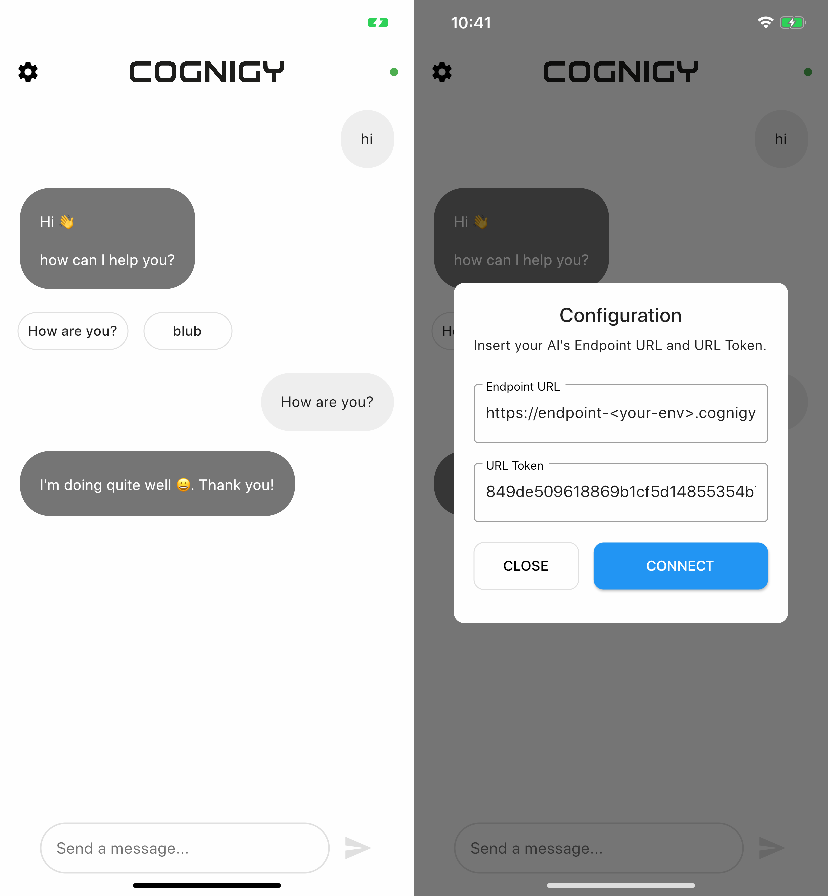

# Cognigy Demo - Flutter App

This project implements a demo mobile application to show how to connect your [Cognigy.AI](https://cognigy.com/) project to a Flutter app. Therefore, the user has to insert the [Socket Endpoint Configuration](https://docs.cognigy.com/docs/deploy-a-socket-endpoint)into the configuration dialog. After that, the application will automatically connect to Cognigy; the status is displayed by a green or red button on the top-right corner of the screen.

## Demo Images

## Enable Push Notifications 

This applications uses the [Flutter Local Notifications](https://pub.dev/packages/flutter_local_notifications) package to provide push notifications on IOS and Android devices. Please follow the linked tutorial and take a look at the [Example Application](https://github.com/MaikuB/flutter_local_notifications/blob/master/flutter_local_notifications/example/lib/main.dart) to get familiar with this solution.

### Send Notifications

In order to send notifications which should be displayed to the user, use the [Cognigy Inject API](https://docs.cognigy.com/reference#inject). When you send a mesage, the Flow will be executed again with the sent text input. If the app is not in the foreground of the user's device, it will show a push notification to let him know that a new message arrived in the chat.

## Todo: 

- [x] Add Push Notifications for enabling notify API usage
- [ ] Add Push Notifications for Android devices
- [x] Store socket url and url token into file to make is persitent over time
- [x] Add list message support
- [ ] Add various styles which the can choose in the settings
- [ ] Add voice input permissions on Android devices: https://pub.dev/packages/speech_to_text